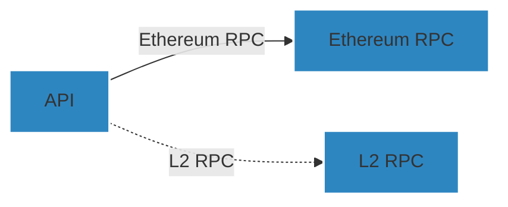

# zkChainHub

## Description

ZKchainHub is envisioned as a permissionless, cloud-agnostic platform that allows anyone to deploy an instance, specifically focusing on the settlement chain.
You can fetch metrics from the ZKsync ecosystem and ZK chains from L1 RPC (Ethereum). Optionally, it will also fetch data from L2 RPCs for the chains where the user provides the RPC.

## 📋 Prerequisites

- Ensure you have `node >= 20.0.0` and `pnpm >= 9.0.0` installed.


## Diagram
This is a high level architecture diagram of the ZKchainHub



## Installation

```bash
$ pnpm install
```

## Running the app

```bash
# development
$ pnpm run start

# watch mode
$ pnpm run start:dev

# production mode
$ pnpm run start:prod

# running a specific app
$ pnpm run start my-app
```

## Test

```bash
# unit tests
$ pnpm run test

# e2e tests
$ pnpm run test:e2e

# test coverage
$ pnpm run test:cov
```

## Creating a new app
```bash
$ pnpm nest g app my-app
```

## Creating a new library
```bash
$ pnpm nest g library my-library
```

## 💻 Conventional Commits
We follow the Conventional Commits [specification](https://www.conventionalcommits.org/en/v1.0.0/#specification).
