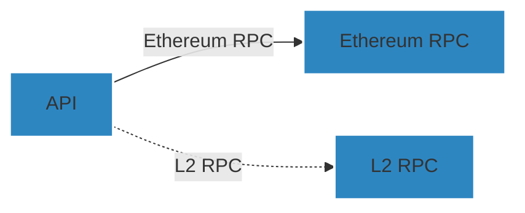

# ZKchainHub - Backend

## Description

ZKchainHub is envisioned as a permissionless, cloud-agnostic platform that allows anyone to deploy an instance, specifically focusing on the settlement chain.
You can fetch metrics from the ZKsync ecosystem and ZK chains from L1 RPC (Ethereum). Optionally, it will also fetch data from L2 RPCs for the chains where the user provides the RPC.

## 📋 Prerequisites

- Ensure you have `node >= 20.0.0` and `pnpm >= 9.0.0` installed.


## Diagram
This is a high level architecture diagram of the ZKchainHub



## Installation

```bash
$ pnpm install
```

## ⚙️ Setting up env variables

- Create `.env` file in the `root` folder and copy paste `.env.example` content in there.
```
$ cp .env.example .env
```
- Set up `L1_RPC_URLS` as CSV list of RPC URLs. For example, `https://eth.llamarpc.com,https://rpc.flashbots.net/fast`. You can check [Chainlist](https://chainlist.org/) for a list of public RPCs
- Set up `L2_RPC_URLS` as CSV list of RPC URLs. For example, `https://mainnet.era.zksync.io`. You can check [Chainlist](https://chainlist.org/) for a list of public RPCs
- Set `COINGECKO_API_KEY`, `COINGECKO_BASE_URL` and `COINGECKO_API_KEY` depending on your API plan. You can get an API Key creating an account on [Coingecko's site](https://www.coingecko.com/en/api)
- (Optionally) Set `PORT` on which API is made available. By default is port 3000

## Running the app

```bash
# development
$ pnpm run start

# watch mode
$ pnpm run start:dev

# production mode
$ pnpm run start:prod

# running a specific app
$ pnpm run start my-app
```

Verify that ZKchainHub API is running on http://localhost:3000 (or the port specified)

## Test

```bash
# unit tests
$ pnpm run test

# e2e tests
$ pnpm run test:e2e

# test coverage
$ pnpm run test:cov
```

## Docs
Locally Swagger docs are available at http://localhost:3000/docs

## Development

### Linter
Run `pnpm lint` to make sure the code base follows configured linter rules.

### Creating a new app
```bash
$ pnpm nest g app <app-name>
```

### Creating a new library
```bash
$ pnpm create-lib <lib-name>
```

### 💻 Conventional Commits
We follow the Conventional Commits [specification](https://www.conventionalcommits.org/en/v1.0.0/#specification).

## Contributing

ZKchainHub was built with ❤️ by [Wonderland](https://defi.sucks).

Wonderland is a team of top Web3 researchers, developers, and operators who believe that the future needs to be open-source, permissionless, and decentralized.

[DeFi sucks](https://defi.sucks), but Wonderland is here to make it better.