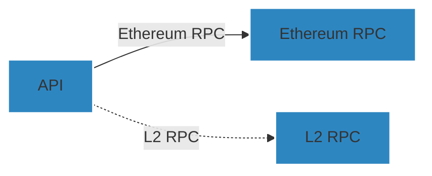

# ZKchainHub - Backend

## Description

ZKchainHub is envisioned as a permissionless, cloud-agnostic platform that allows anyone to deploy an instance, specifically focusing on the settlement chain.
You can fetch metrics from the ZKsync ecosystem and ZK chains from L1 RPC (Ethereum). Optionally, it will also fetch data from L2 RPCs for the chains where the user provides the RPC.

## Overview

This repository is a monorepo consisting of 4 packages and 1 app:

-   [`@zkchainhub/shared`](./packages/shared): A library for shared configurations, constants, types, etc.
-   [`@zkchainhub/chain-providers`](./packages/chain-providers): A library that provides abstracted services over Viem providers to query blockchain data
-   [`@zkchainhub/pricing`](./packages/pricing): An extensible library that provides Pricing services to fetch token prices. Currently, only Coingecko provider is developed
-   [`@zkchainhub/metadata`](./packages/metadata): A library that exposes different providers for fetching chains and tokens metadata.
-   [`@zkchainhub/metrics`](./packages/metrics): A library that provides different aggregated metrics from the ZKsync ecosystem and ZK chains.
-   [`@zkchainhub/api`](./apps/api): An Express server that exposes an API where you can fetch information about ZKsync ecosystem and their chains, using the before mentioned libraries

## 📋 Prerequisites

-   Ensure you have `node >= 20.0.0` and `pnpm >= 9.5.0` installed.

## Diagram

This is a high level architecture diagram of the ZKchainHub



## Installation

```bash
$ pnpm install
```

## Building

To build the monorepo packages, run:

```bash
$ pnpm build
```

## ⚙️ Setting up env variables

-   Follow the instructions for `apps/api` on [API's README](./apps/api/README.md)

## Running the app

```bash
# development watch mode
$ pnpm run dev

# production mode
$ pnpm run start

```

Verify that ZKchainHub API is running on http://localhost:3000 (or the port specified)

## Test

```bash
# unit tests
$ pnpm run test

# e2e tests
$ pnpm run test:e2e

# test coverage
$ pnpm run test:cov
```

# Deployment

## Docker

To build a Docker image for the API, navigate to the root directory of the monorepo and run the following command:

```
docker build . --target api --tag api:latest
```

## Docs

Locally Swagger docs are available at http://localhost:3000/docs

## Development

### Linter

Run `pnpm run lint` to make sure the code base follows configured linter rules.

### 💻 Conventional Commits

We follow the Conventional Commits [specification](https://www.conventionalcommits.org/en/v1.0.0/#specification).

## Contributing

ZKchainHub was built with ❤️ by [Wonderland](https://defi.sucks).

Wonderland is a team of top Web3 researchers, developers, and operators who believe that the future needs to be open-source, permissionless, and decentralized.

[DeFi sucks](https://defi.sucks), but Wonderland is here to make it better.

## License

This project is licensed under the MIT License. See the [`LICENSE`](./LICENSE) file for details.
